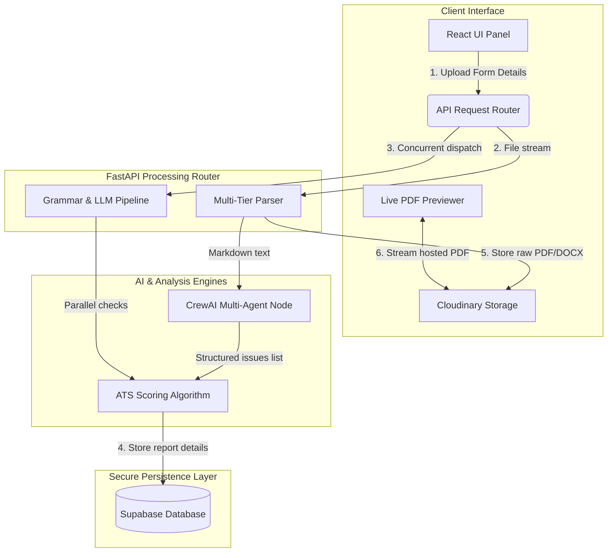

<!-- Improved compatibility of back to top link: See: https://github.com/othneildrew/Best-README-Template/pull/73 -->
<a id="readme-top"></a>

<!-- PROJECT SHIELDS -->
<!-- Using reference style links for clean markdown layout -->
[![Contributors][contributors-shield]][contributors-url]
[![Forks][forks-shield]][forks-url]
[![Stargazers][stars-shield]][stars-url]
[![Issues][issues-shield]][issues-url]
[![MIT License][license-shield]][license-url]
[![LinkedIn][linkedin-shield]][linkedin-url]

<!-- PROJECT LOGO -->
<br />
<div align="center">
  <a href="https://github.com/JAINAM576/CareerDesk-AI-Resume-Auditor-Job-Discovery">
    
  </a>

  <h3 align="center">CareerDesk</h3>

  <p align="center">
    An AI-Powered ATS Resume Auditing & Job Discovery Engine
    <br />
    <a href="https://github.com/JAINAM576/CareerDesk-AI-Resume-Auditor-Job-Discovery"><strong>Explore the docs »</strong></a>
    <br />
    <br />
    <a href="https://github.com/JAINAM576/CareerDesk-AI-Resume-Auditor-Job-Discovery">View Demo</a>
    &middot;
    <a href="https://github.com/JAINAM576/CareerDesk-AI-Resume-Auditor-Job-Discovery/issues">Report Bug</a>
    &middot;
    <a href="https://github.com/JAINAM576/CareerDesk-AI-Resume-Auditor-Job-Discovery/issues">Request Feature</a>
  </p>
</div>

<!-- TABLE OF CONTENTS -->
<details>
  <summary>Table of Contents</summary>
  <ol>
    <li>
      <a href="#about-the-project">About The Project</a>
      <ul>
        <li><a href="#built-with">Built With</a></li>
      </ul>
    </li>
    <li>
      <a href="#technical-architecture">Technical Architecture</a>
      <ul>
        <li><a href="#1-multi-tiered-parsing-pipeline">1. Multi-Tiered Parsing Pipeline</a></li>
        <li><a href="#2-crewai-multi-agent-node">2. CrewAI Multi-Agent Node</a></li>
        <li><a href="#3-database--storage-layer">3. Database & Storage Layer</a></li>
        <li><a href="#4-ats-scoring-algorithm">4. ATS Scoring Algorithm</a></li>
      </ul>
    </li>
    <li>
      <a href="#getting-started">Getting Started</a>
      <ul>
        <li><a href="#prerequisites">Prerequisites</a></li>
        <li><a href="#backend-setup">Backend Setup</a></li>
        <li><a href="#frontend-setup">Frontend Setup</a></li>
      </ul>
    </li>
    <li><a href="#usage">Usage</a></li>
    <li><a href="#roadmap">Roadmap</a></li>
    <li><a href="#contributing">Contributing</a></li>
    <li><a href="#license">License</a></li>
    <li><a href="#contact">Contact</a></li>
  </ol>
</details>

<!-- ABOUT THE PROJECT -->
## About The Project

CareerDesk is an advanced career sandbox dashboard designed to optimize your job search workflow. By combining automated document parsing, multi-agent AI assessments, compliance auditing, and live job aggregates, CareerDesk gives candidates an executive-level overview of their target profile compatibility.

Key highlights of the platform:
* **ConcurrentUser Threads**: Speeds up resume parsing and grammar audits by running checks in parallel.
* **Interactive Severity Badges**: Sorts compliance audits by severity (Critical blockers first, Warnings, Suggestions) with reactive toggle filtering.
* **Seeded Sandboxing**: Preloads a mock database history row for new users to immediately explore the dashboard's analytics without prior uploads.
* **Cascading Location Selectors**: Smooth, type-to-filter dropdown select lists that prevent layout overflows.

<p align="right">(<a href="#readme-top">back to top</a>)</p>

### Built With

* [![React][React.js]][React-url]
* [![FastAPI][FastAPI.org]][FastAPI-url]
* [![Python][Python.org]][Python-url]
* [![SQLAlchemy][SQLAlchemy.org]][SQLAlchemy-url]
* [![TailwindCSS][TailwindCSS.com]][TailwindCSS-url]

<p align="right">(<a href="#readme-top">back to top</a>)</p>

<!-- TECHNICAL ARCHITECTURE -->
## Technical Architecture



### 1. Multi-Tiered Parsing Pipeline
- **Word Document Parsing (`.docx`)**: Runs `python-docx` to compile paragraph and table cell text blocks.
- **PDF Document Parsing (`.pdf`)**: Employs a resilient three-tier fallback pipeline:
  - **Tier 1 (MarkItDown)**: Attempts to convert the PDF to formatted Markdown.
  - **Tier 2 (Advanced OCR)**: If Tier 1 returns $< 100$ characters, the file is submitted to a cloud extraction task to run OCR and layout-analysis.
  - **Tier 3 (Baseline Extraction)**: Falls back to `pdfplumber` to extract raw text coordinates as a baseline if Tier 2 is disabled or encounters network errors.

### 2. CrewAI Multi-Agent Node
- **ATS Auditor Agent**: Operates as a senior recruiter, evaluating the resume against target role guidelines, matching keywords, and compiling structured JSON outputs.
- **Task Schema (Pydantic)**: Enforces JSON compliance using the `ATSAnalyzerOutputSchema` model to map `IssueItem` lists and executive summaries.

### 3. Database & Storage Layer
- **Supabase PostgreSQL**: Connection endpoints route over IPv4 connection poolers (port `6543`) to prevent IPv6 interface routing failures.
- **Cloudinary CDN**: Uploaded PDF/DOCX files are hosted on Cloudinary. This allows the embedded preview iframe to stream historical documents side-by-side with recommendations, even when restored from the history list.

### 4. ATS Scoring Algorithm
Calculations are executed deterministically on the backend to prevent score drift:
$$\text{Final Score} = \max(0, 100 - \sum \text{Deductions})$$
Deductions are grouped as:
* **Critical Issues**: Deducts `-15` points.
* **Warnings**: Deducts `-7` points.
* **Suggestions**: Deducts `-3` points.

<p align="right">(<a href="#readme-top">back to top</a>)</p>

<!-- GETTING STARTED -->
## Getting Started

To run the application locally, follow these configuration steps:

### Prerequisites

Verify you have installed:
* Python 3.10+
* Node.js 18+ & npm
  ```sh
  npm install npm@latest -g
  ```

### Backend Setup

1. Copy the sample environment settings:
   ```sh
   cp backend.env.sample backend/.env
   ```
2. Configure `.env` with your API credentials (including your database pooler, Cloudinary tokens, and LLM keys).
3. Activate the virtual environment:
   ```sh
   source .venv/bin/activate
   ```
4. Install dependencies:
   ```sh
   pip install -r requirements.txt
   ```
5. Run the server:
   ```sh
   PYTHONPATH=. uvicorn app.main:app --reload --port 8000
   ```

### Frontend Setup

1. Copy the sample environment settings:
   ```sh
   cp frontend.env.sample frontend/.env
   ```
2. Install npm packages:
   ```sh
   npm install
   ```
3. Run the development server:
   ```sh
   npm run dev
   ```

<p align="right">(<a href="#readme-top">back to top</a>)</p>

<!-- USAGE EXAMPLES -->
## Usage

Upload a resume document, select your target location and job mode, and explore the parsed dashboard workspace:
- **Tab 1: ATS Audit**: Displays executive summaries and severity-categorized checklist audits.
- **Tab 2: Skill Gaps**: Highlights capability discrepancies alongside targeted project blueprints.
- **Tab 3: Match Openings**: Searches live job boards for matching positions.

<p align="right">(<a href="#readme-top">back to top</a>)</p>

<!-- ROADMAP -->
## Roadmap

- [x] Integrate Supabase Database & Auth sessions
- [x] Configure Cloudinary secure hosting for visual PDF previews
- [x] Implement parallel LLM parsing threads
- [ ] Add resume template exporter (PDF download)
- [ ] Integrate OAuth (Google/GitHub Sign-In)

<p align="right">(<a href="#readme-top">back to top</a>)</p>

<!-- CONTRIBUTING -->
## Contributing

Contributions are what make the open source community such an amazing place to learn, inspire, and create. Any contributions you make are **greatly appreciated**.

1. Fork the Project
2. Create your Feature Branch (`git checkout -b feature/AmazingFeature`)
3. Commit your Changes (`git commit -m 'Add some AmazingFeature'`)
4. Push to the Branch (`git push origin feature/AmazingFeature`)
5. Open a Pull Request

<p align="right">(<a href="#readme-top">back to top</a>)</p>

<!-- LICENSE -->
## License

Distributed under the MIT License. See `LICENSE.txt` for more information.

<p align="right">(<a href="#readme-top">back to top</a>)</p>

<!-- CONTACT -->
## Contact

Project Link: [https://github.com/JAINAM576/CareerDesk-AI-Resume-Auditor-Job-Discovery](https://github.com/JAINAM576/CareerDesk-AI-Resume-Auditor-Job-Discovery)

<!-- MARKDOWN LINKS & IMAGES -->
[contributors-shield]: https://img.shields.io/github/contributors/JAINAM576/CareerDesk-AI-Resume-Auditor-Job-Discovery.svg?style=for-the-badge
[contributors-url]: https://github.com/JAINAM576/CareerDesk-AI-Resume-Auditor-Job-Discovery/graphs/contributors
[forks-shield]: https://img.shields.io/github/forks/JAINAM576/CareerDesk-AI-Resume-Auditor-Job-Discovery.svg?style=for-the-badge
[forks-url]: https://github.com/JAINAM576/CareerDesk-AI-Resume-Auditor-Job-Discovery/network/members
[stars-shield]: https://img.shields.io/github/stars/JAINAM576/CareerDesk-AI-Resume-Auditor-Job-Discovery.svg?style=for-the-badge
[stars-url]: https://github.com/JAINAM576/CareerDesk-AI-Resume-Auditor-Job-Discovery/stargazers
[issues-shield]: https://img.shields.io/github/issues/JAINAM576/CareerDesk-AI-Resume-Auditor-Job-Discovery.svg?style=for-the-badge
[issues-url]: https://github.com/JAINAM576/CareerDesk-AI-Resume-Auditor-Job-Discovery/issues
[license-shield]: https://img.shields.io/github/license/JAINAM576/CareerDesk-AI-Resume-Auditor-Job-Discovery.svg?style=for-the-badge
[license-url]: https://github.com/JAINAM576/CareerDesk-AI-Resume-Auditor-Job-Discovery/blob/master/LICENSE.txt
[linkedin-shield]: https://img.shields.io/badge/-LinkedIn-black.svg?style=for-the-badge&logo=linkedin&colorB=555
[linkedin-url]: https://linkedin.com/
[product-screenshot]: frontend/public/favicon.svg

[React.js]: https://img.shields.io/badge/React-20232A?style=for-the-badge&logo=react&logoColor=61DAFB
[React-url]: https://reactjs.org/
[FastAPI.org]: https://img.shields.io/badge/FastAPI-005571?style=for-the-badge&logo=fastapi&logoColor=white
[FastAPI-url]: https://fastapi.tiangolo.com/
[Python.org]: https://img.shields.io/badge/Python-3776AB?style=for-the-badge&logo=python&logoColor=white
[Python-url]: https://www.python.org/
[SQLAlchemy.org]: https://img.shields.io/badge/SQLAlchemy-D71F00?style=for-the-badge&logo=sqlalchemy&logoColor=white
[SQLAlchemy-url]: https://www.sqlalchemy.org/
[TailwindCSS.com]: https://img.shields.io/badge/Tailwind_CSS-38B2AC?style=for-the-badge&logo=tailwindcss&logoColor=white
[TailwindCSS-url]: https://tailwindcss.com/
